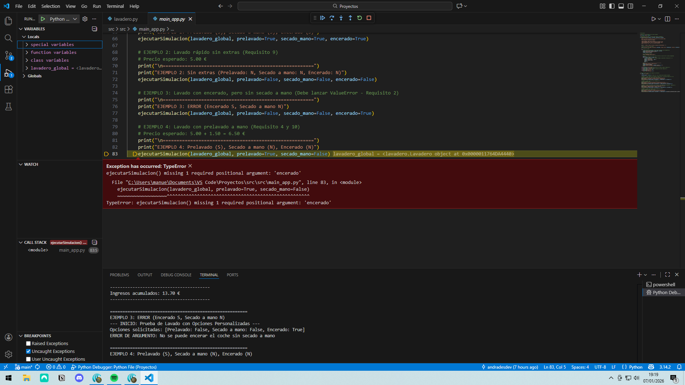

En este apartado se describe el proceso de ejecución y depuración de la aplicación del lavadero, los problemas detectados durante el desarrollo y cómo han sido solucionados utilizando el entorno de desarrollo y las herramientas de depuración.

El entorno de desarrollo nos sirve para crear nuestras aplicaciones y además podemos comprobar los errores que tienen, problemas de seguridad, etc. por lo que desde allí vamos a poder corregirlos.

- Nos vamos a la sección de ejecución y depuración.
- La primera vez, creamos un archivo de configuración, pulsando en Show automatic Python configurations y seleccionamos en nuestro proyecto.
- Para ejecutar el código le damos al símbolo de play de Python:


- Vemos como en el terminal se ejecuta el programa.

Tras realizar el proceso de depuración por primera vez podemos comprobar que existe un error que nos impide continaur con la ejecución y por tanto el primer cambiuo que debemos hacer.



Como podemos ver en el mensaje mostrado, el error se debe simplemente a la falta de un argumento en la función ```ejecutarSimulacion``` que impedía la correcta continuación del programa mencionado.


Tras la adicion del argumento, la depuración puede terminar sin mayor problema.
