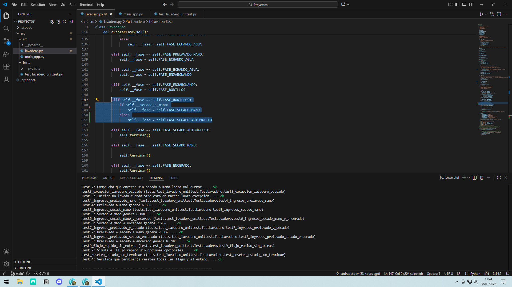
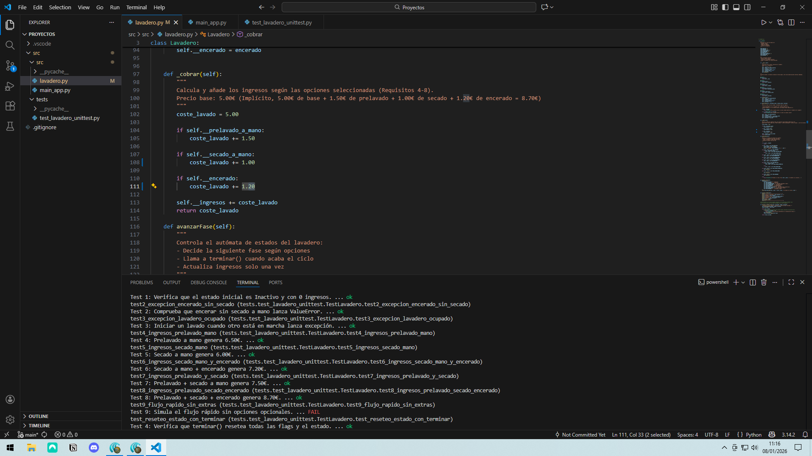
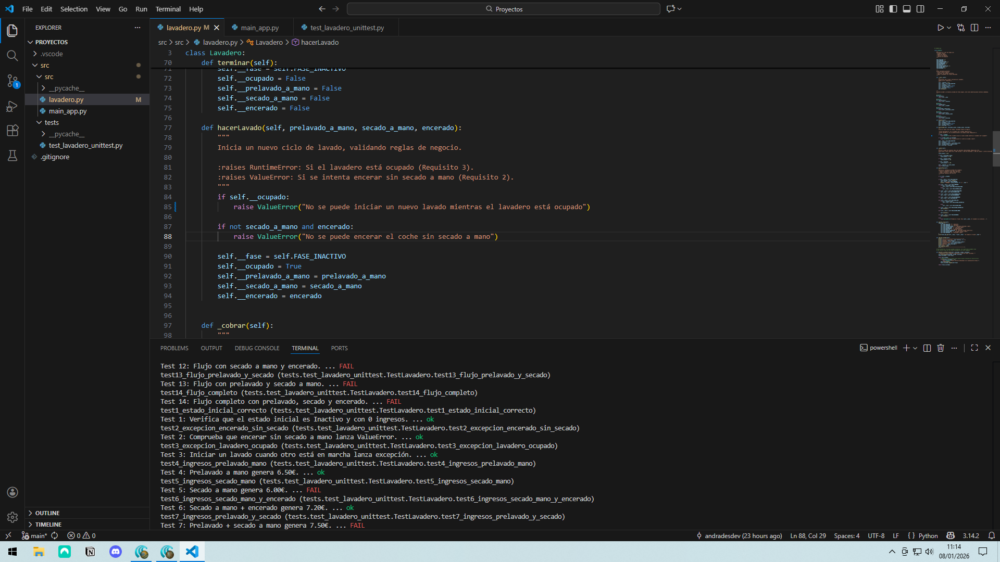
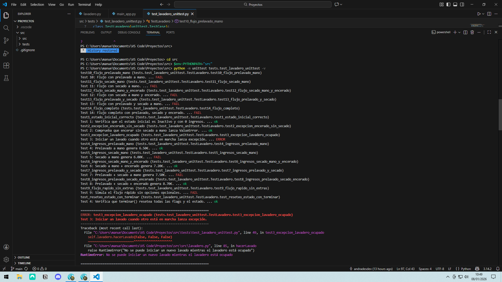

En este apartado se describen las pruebas unitarias realizadas sobre la aplicación del lavadero, los errores detectados durante su ejecución y cómo estas pruebas han permitido validar el correcto funcionamiento del sistema.

Las pruebas se han desarrollado utilizando el módulo estándar unittest de Python y se han ejecutado desde el IDE Visual Studio Code usando su línea de comandos.

## Objetivo de las pruebas

El objetivo principal de las pruebas unitarias ha sido:

- Verificar el estado inicial del lavadero.

- Comprobar el cumplimiento de las reglas de negocio.

- Validar el cálculo correcto de los ingresos.

- Asegurar que la secuencia de fases del lavado es la correcta.

- Detectar errores de lógica y diseño en el autómata de estados.

## Estructura de las pruebas

Las pruebas se encuentran en la carpeta:

tests/test_lavadero_unittest.py

El archivo contiene una clase de pruebas:

```class TestLavadero(unittest.TestCase):```

Cada método de prueba verifica un comportamiento concreto del sistema.

Tipos de pruebas realizadas:

### Pruebas de estado inicial

Se verifica que el lavadero comienza en un estado correcto:

```
def test1_estado_inicial_correcto(self):
    self.assertEqual(self.lavadero.fase, Lavadero.FASE_INACTIVO)
    self.assertEqual(self.lavadero.ingresos, 0.0)
    self.assertFalse(self.lavadero.ocupado)
```

Esto garantiza que el sistema comienza en una situación correcta antes de cualquier operación.

### Pruebas de reglas de negocio

Se comprueba que se lanzan excepciones cuando se incumplen las reglas definidas:

Encerado sin secado a mano:

```
def test2_excepcion_encerado_sin_secado(self):
    with self.assertRaises(ValueError):
        self.lavadero.hacerLavado(False, False, True)
```

Lavadero ocupado:

```
def test3_excepcion_lavadero_ocupado(self):
    self.lavadero.hacerLavado(False, False, False)
    with self.assertRaises(RuntimeError):
        self.lavadero.hacerLavado(False, False, False)
```

Estas pruebas aseguran que las restricciones del sistema se respetan correctamente.

### Pruebas de cálculo de ingresos

Se valida que el importe cobrado corresponde a las opciones seleccionadas:

```
def test5_ingresos_secado_mano(self):
    self.lavadero.hacerLavado(False, True, False)
    while self.lavadero.ocupado:
        self.lavadero.avanzarFase()
    self.assertEqual(self.lavadero.ingresos, 6.00)
```

También se prueban combinaciones más complejas, como prelavado + secado + encerado, validando la suma correcta de los costes.

### Pruebas del flujo de fases (autómata)

Para comprobar el orden correcto de las fases, se utiliza el método ```auxiliar ejecutar_y_obtener_fases():```

```
def test9_flujo_rapido_sin_extras(self):
    fases_esperadas = [0, 1, 3, 4, 5, 6, 0]
    fases_obtenidas = self.lavadero.ejecutar_y_obtener_fases(False, False, False)
```
```self.assertEqual(
    fases_obtenidas,
    fases_esperadas,
    f"Secuencia de fases incorrecta.\n"
    f"Esperadas: {fases_esperadas}\n"
    f"Obtenidas: {fases_obtenidas}"
    )
```

Se prueban múltiples flujos:

Lavado rápido.

Prelavado a mano.

Secado a mano.

Secado + encerado.

Flujo completo con todas las opciones.

## Errores encontrados durante las pruebas
### Error 1: Secuencia de fases incorrecta

Al ejecutar las pruebas de flujo, se detectó que el sistema entraba en fases incorrectas (por ejemplo, secado a mano cuando debía ser automático).

Este error permitió localizar un fallo en la lógica del método avanzarFase() y corregir la transición entre estados.



### Error 2: Ingresos mal calculados

Algunas pruebas de ingresos fallaban debido a que se estaban sumando costes incorrectos.
Gracias a las pruebas unitarias, se ajustaron los importes y se verificó que cada opción añadía el coste correspondiente.




### Error 3: Excepciones no coincidentes

Se detectó que el tipo de excepción lanzada no coincidía con la esperada por las pruebas, lo que obligó a revisar y ajustar el tipo de excepción utilizada en el código.



## Ejecución de las pruebas en el IDE

Las pruebas se han ejecutado desde el terminal integrado de Visual Studio Code utilizando el modo verbose:

```python -m unittest tests.test_lavadero_unittest -v```



El modificador -v permite visualizar:

El nombre de cada test.

Su descripción.

El resultado individual (OK / FAIL).


Terminal de Visual Studio Code mostrando la ejecución completa del conjunto de pruebas con todos los tests superados y el nombre del usuario visible.