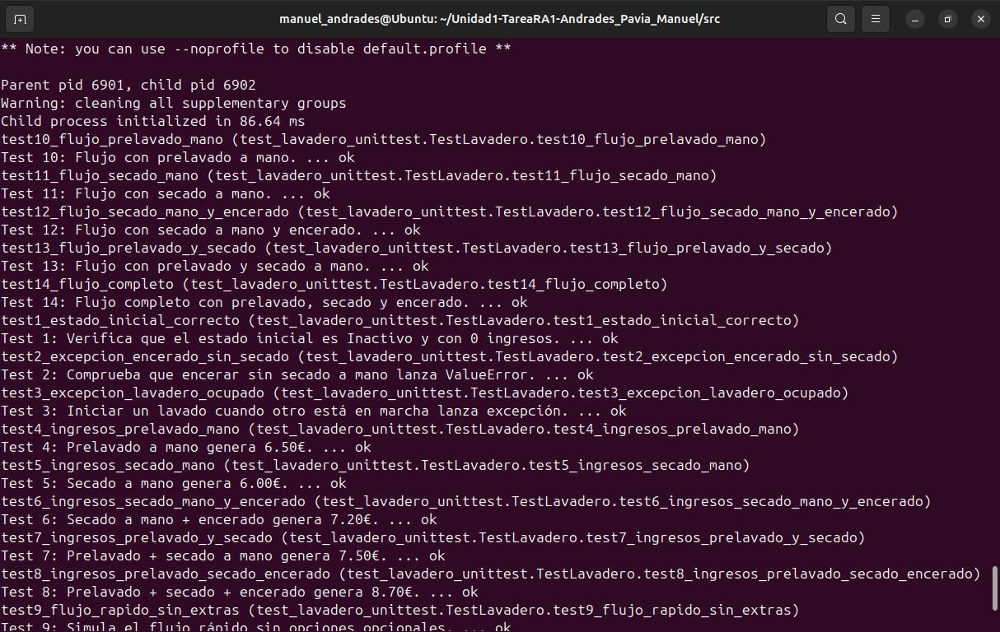

En este apartado se describe el proceso de ejecución de la aplicación en un entorno aislado (Sandbox), utilizando la herramienta Firejail, con el objetivo de mejorar la seguridad y evitar que la aplicación tenga acceso no controlado al sistema.

## ¿Qué es una Sandbox?

Una Sandbox es un entorno de ejecución aislado que limita los permisos y recursos disponibles para una aplicación. Su objetivo principal es:

- Proteger el sistema anfitrión.

- Reducir el impacto de posibles errores o comportamientos maliciosos.

- Limitar el acceso a archivos, red y procesos del sistema.

Este tipo de entornos es ampliamente utilizado en seguridad informática, especialmente para ejecutar software no confiable o en fase de pruebas.

## Herramienta utilizada: Firejail

Para esta práctica se ha utilizado Firejail, una herramienta de sandboxing para sistemas Linux que emplea:

- Namespaces del kernel de Linux.

- Seccomp-bpf para filtrar llamadas al sistema.

- Perfiles de seguridad predefinidos.

Firejail permite ejecutar programas de forma aislada sin necesidad de virtualizar completamente el sistema.

## Instalación de Firejail y Firetools

Para instalar las herramientas necesarias se utilizaron los siguientes comandos:

```sudo apt update
sudo apt install firejail firetools
```

Firetools proporciona una interfaz gráfica, mientras que Firejail permite ejecutar aplicaciones directamente desde la terminal. Em este caso hemos hecho uso solo de Firejail para agilizar la ejecución de la tarea.

## Ejecución de la aplicación en Sandbox

Para ejecutar las pruebas unitarias del proyecto en un entorno aislado, se utilizó el siguiente comando:

```firejail --private=. python3 -m unittest discover -s tests -v```

De esta forma, el proceso se ejecuta sin acceso al resto del sistema de archivos ni a la red.

## Resultado de la ejecución

Durante la ejecución:

Firejail carga su perfil de seguridad por defecto.

Se restringen permisos y accesos del proceso.

Las pruebas unitarias se ejecutan correctamente dentro del entorno aislado.



Terminal de Ubuntu mostrando la ejecución del comando firejail con el nombre del usuario visible y la carga del perfil de seguridad.